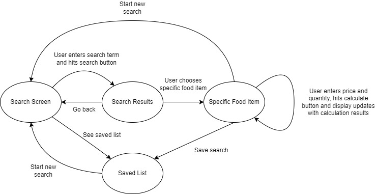
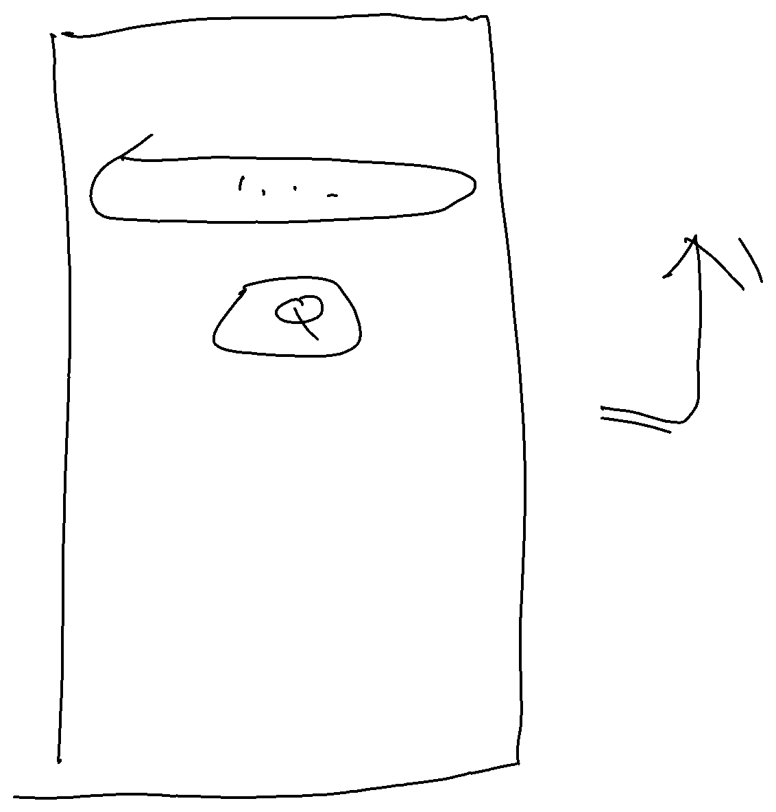
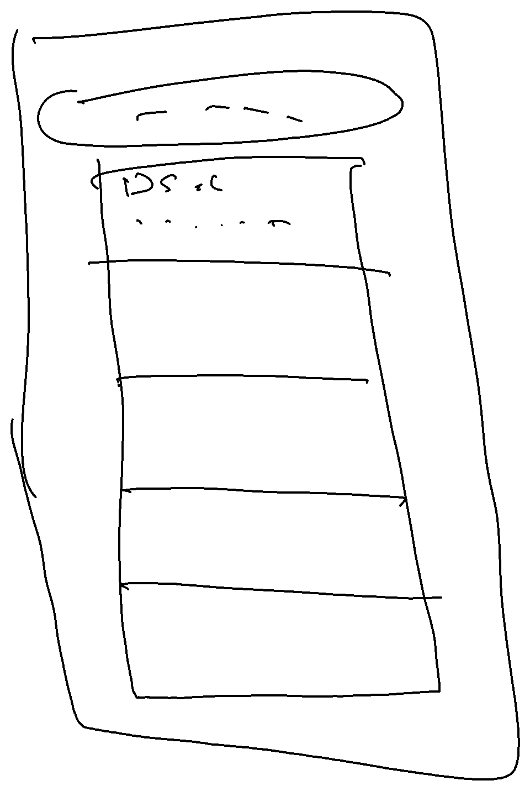
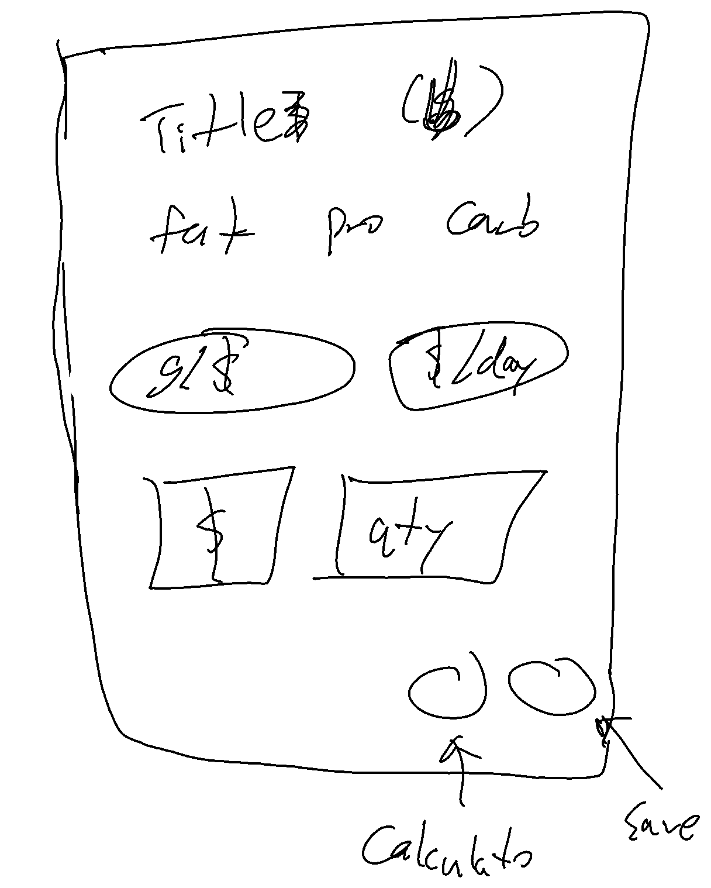
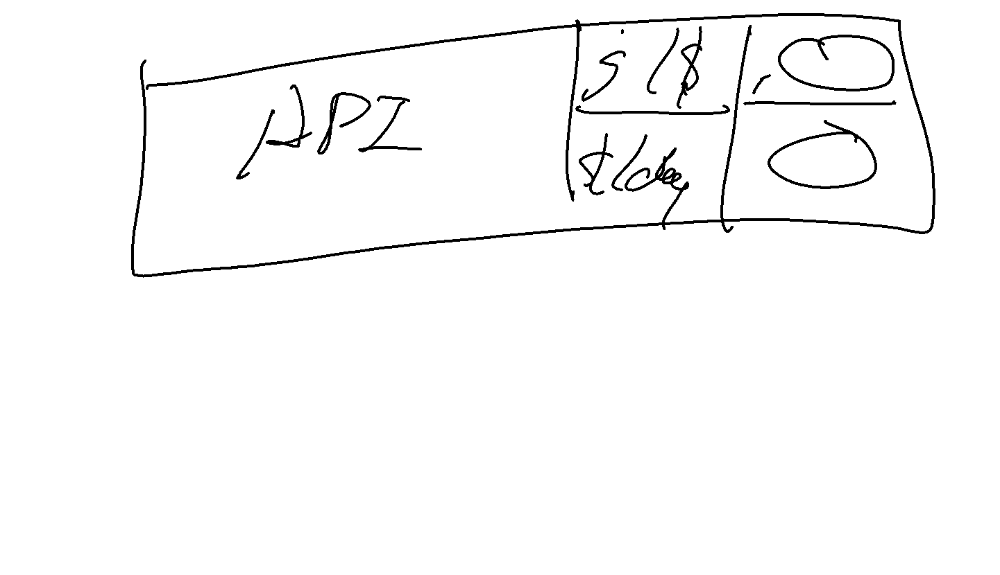
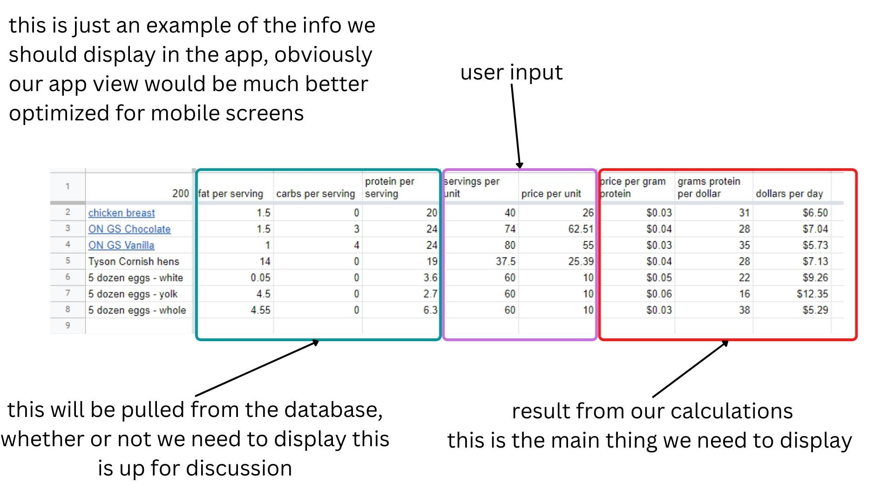

# cmpe272-team1-project
Protein Pricer
CMPE 272 Enterprise Software Platforms Instructor: Professor Rakesh Ranjan Computer Engineering Department
San José State University https://github.com/rayraysheng/cmpe272-team1-project

Ray Sheng
Software Engineering, San José State University 
yumeng.sheng@sjsu.edu

Kai-Wei Yang
Computer Engineering, San José State University
kai-wei.yang@sjsu.edu

Lalitha Ramya Vemuri
Software Engineering, San José State University 
lalitharamya.vemuri@sjsu.edu

Zeel Vasant Satasiya
Software Engineering, San José State University
zeelvasant.satasiya@sjsu.edu

## Abstract
The number one macronutrient desired by dieters, athletes, and bodybuilders alike is protein, which is also the most expensive macronutrient[1]. In this report, we present a consumer-friendly solution for calculating and comparing food prices based on the amount of protein they provide per dollar spent. We plan on developing an Android application that enables the user to search for specific food items from the United States Department of Agriculture FoodData Central database to calculate their protein-per-dollar value, with the option of saving their search results to their account (stored in Firebase Realtime Database) for quick reference in the future.
Keywords—Dieting and fitness; food price comparison; meal planning; Android application; Firebase Realtime Database.

## INTRODUCTION
With time growing, people tend to live healthier lives and acquire enough nutrition to sustain muscle growing and energy supplement. The food in the market varies from different places. The customers would have a lot of choice to get the food they want. However, the food with similar nutrition would be priced differently. For example, the price of the chicken breast and the chicken tender with the same amount of protein may have over 5 bucks more price difference. People nowadays tend to get the nutrition with a cheaper price to save some money. Dieters, athletes, and bodybuilders would need to consume an amount of protein to meet their daily intake to build muscle. To consume the huge amount of protein, people would compare the food price in the market and get the protein with the best cost-performance ratio. Therefore, a tool to calculate the protein per gram would be necessary for users to record and save their budget. In our project, we would design an android application for users to input the food they want to get in the market. After the app users input the food name, the android application would calculate the protein per gram for the users and store the search history data in the local storage. With the search history and the protein calculation result. Users could compare the results and choose the food with the best cost-price ratio in the market. We would elaborate more on our application structure and function in the following section.  
There are many mobile applications on the market that help people keep track of what they eat and make dietary decisions based on energy intake. The functions of these applications vary in scope: some may offer advice and encouragement for weight loss, while others might simply serve as a calorie tracking tool without any bells and whistles. One niche area that seems to not have been covered yet is to take into consideration the economic factor - helping dieters get the most bang for their buck when they plan their meals. 
The Protein Pricer app is not meant to be a replacement for the meal-tracking apps that are currently available on the market, it is instead meant to be a specialized companion app that helps the user choose sources of protein based on price when they shop for groceries. Nor does our app attempt to coach users on how to plan their diet, i.e. tell them what to eat. That is an area that requires the users themselves to take personal responsibility to do their own research. 

## PERSONA
Dieters, Athletes, Bodybuilders
People that have a need for high protein intake who are either unable or unwilling to allocate large budgets for their food can use our app to compare different sources of protein based on price.

## SYSTEM ARCHITECTURE

Our Android app consists of an UI layer that takes user input and displays search/calculation results, a Domain layer that handles the calculations, and a data layer that processes the data used in the calculations and display.
The Domain layer uses the users’ Google accounts to handle user sign-in via Firebase Authentication services. The Data layer makes HTTP API calls to retrieve food item data from the USDA FoodData Central database. The Data layer also connects to Firebase Realtime Database services to save and retrieve user’s saved searches.

Figure 1: Architecture

### User Interface
The users could sign in their google account in the user sign in page to authenticate their identity. After the user verification, users would route to our home page(search page). If users do not have an account, they can just click on the skip sign in button to move to the home page. On the home page, people can enter the food name or the key word of the food in the search bar. After the application gets the name of the food, the app would return a food list with the same name of the food with different brands for users to choose. Users would choose the brand of the food which the user gets. With all the information, the application would take the users to the calculation page. On the calculation page, there are two input boxes for users to enter. One is the total gram of the food. The other is the price of the food. After users input the total gram of the food and the price of it. The calculation page would return how many proteins per dollar and display on the calculation page. For every users’ search, the search history page would list all the searches for the users to acquire the information faster if they want to re-search the item. Moreover, there is a home button on each page for users to redirect to the home page.

### Back-End Database
For storing the data we have used Firebase Real-time Database. It allows you to directly communicate with the database from the front-end and store data in real time. Firebase is a cloud-hosted NoSQL database that allows storing data in the form of JSON. This makes it easier for us to extract relevant data from the database by applying filters and displaying it to the users. 
When a user adds the food item to the saved list, we use the food item ID as the unique identifier to save it in the database. This ensures that the item is not being duplicated in the database and the user’s saved list is maintained without any conflicts. The data of each user is stored separately and can be extracted using the unique userID that is maintained during the session.
Firebase also provides an authentication feature using password, phone numbers and also using identity providers like Google, Facebook. Firebase has an Authentication SDK, which provides methods to manage users and create their profiles by signing up using email IDs and passwords. We have integrated the login page with federated identity providers which will allow users to directly sign in with a google account.

### Data Source
Commercial meal-tracking apps on the market usually create and maintain their own database for nutrition information on food items. For this project, this approach would not be feasible for us, as we do not have the resources to do so. Instead, we used the FoodData Central API to access FoodData Central, maintained by the United States Department of Agriculture.
When a search term is entered by the user through the UI layer of the app, an URL is constructed by the app to make an API call to the FoodData Central database, which returns the response in JSON format. The API response contains the metadata of the search, as well as a list of JSON objects that represent the specific food items that are returned (figure 2). 

Figure 2: API Response

The Data layer of the app parses the response and isolates the food item objects. From these food item objects, the Data layer then parses each food item and extracts the relevant nutrient information that is used in calculations in the Domain layer and displayed in the UI layer (figure 3).

Figure 3: Relevant Nutrients

## FUTURE IMPROVEMENTS
Currently, our application is using the USDA dataset and their APIs to access various food items. But in order to maintain consistency and faster access, we can create a database with the most frequently searched items. The application design currently accepts keywords to retrieve data. But we can expand this design and integrate search suggestions based on previous searches, saved items, location which will help users with exploring options. Users can further search for outlets and stores that have an ongoing sale and discounts to assist users in making more economic choices. 
To expand the saved list, we will also add features to manage and predict daily, monthly and weekly costs depending on the protein intake and average amount spent on a daily basis. Based on the data the users want to display, the options can be customized.
Another improvement that can be made is to include allergies and other dietary restrictions so that the app can make an informed decision on what options and choices should be displayed, thus improving the display with more personalized results.

## CONCLUSION
The Protein Pricer app enables the user to search and compare the amount of protein different food items provide vis-a-vis their dollar cost. It taps into a central database maintained by the United States Department of Agriculture for macronutrient values to ensure accuracy and convenience. It also allows the user to save their search results to their user account in a Firebase Realtime Database, so they can be retrieved later for quick reference and comparison. Armed with this tool, any user that prioritizes protein intake can have a convenient way to get the most bang for their buck when it comes to protein sources.

## Project Repository
Github Repository: https://github.com/rayraysheng/cmpe272-team1-project 
APK Download Link:
https://github.com/rayraysheng/cmpe272-team1-project/blob/main/protein_pricer.apk 

## References
Drewnowski A. (2010). The cost of US foods as related to their nutritive value. The American journal of clinical nutrition, 92(5), 1181–1188. https://doi.org/10.3945/ajcn.2010.29300 

## Project Planning - Internal Use ##

### UPDATES ###

#### 2022-11-22

[bound service](https://www.youtube.com/watch?v=angnIJMsCI8&ab_channel=CodingPursuit)

#### 2022-11-08

##### Thing to work on for this week: 
1. Refine api interaction to encapsulate the search results and provide getter methods for specific data fields - Ray
2. Build app prototype and setup screens so they can go from page to page according to our app functions - Kai
3. Implement local relational database within the app using Room to store user saved data - Lalitha & Zeel

##### Proxy getter targets:
- String: food ID
- int: carbs
- int: fat
- int: protein
- int: total Calories
- String: unit
- String: brand
- String: description

##### Screens flow:

Search Screen:

Search Results:

Specific Food Item:

Saved List:

##### Calculations:
1. Grams of Protein per Dollar = ( protein * quantity ) / price
    - protein is returned from http request
 	- quantity and price are user-entered
1. Dollars per Day for Protein = ( price / ( protein * quantity ) ) * daily_protein
 	- protein is returned from http request
 	- quantity and price are user-entered
 	- daily_protein is saved by user in a setting screen (to be implemented later), we can use a hard-coded value for now

#### 2022-10-25

##### Summary

So far we have explored the USDA database API and have become more confident with it. We have successfully tested using it to retrieve relevant data from the database. We will explore it further with 2 goals in mind: 
1. make the API calls directly using Java so that the mobile app can directly information from the database without needing setting up our own backend
2. develop Java methods to parse the returned JSON objects and isolate the specific data fields that we will be using in the app

As for Tensorflow.js, currently we do not have any requirements that would call for machine learning features. If we want to add them in the future, we can come back to it and investigate.

Before we can start doing actual work on the app, we will need to set up the Android Studio project itself, with special regards to dependency management. This will ensure that everyone is using the same Java version and all of the necessary packages are available to use. This would also give us a better idea of how Android studio works and how to deploy the app. 

One last missing part of the puzzle is the cloud database that we will need to setup and maintain to manage app user data. The main requirement for this database is that the app will have to have some way to do read and write operations on it.

During the meeting, we mentioned that we should also think about wireframing the app UI before we start building it. Once we have the Android Studio project set up, we can brainstorm the UI together.

It was also mentioned that we should each use a separate branch of the github repo, instead of directly pushing to master.

##### Next Steps

Right now, we have 3 components of the project going on in parallel. 

1. USDA food database & API
	- Todo:
		1. test ways of making API calls to the USDA food database directly using Java
		2. further explore the JSON objects returned and better understand where the relevant data fields are
	- References: 
		- [How to use Java URLConnection and HttpURLConnection
](https://www.codejava.net/java-se/networking/how-to-use-java-urlconnection-and-httpurlconnection)
		- [Java URLConnection and HttpURLConnection Examples
](https://www.codejava.net/java-se/networking/java-urlconnection-and-httpurlconnection-examples)
		- [Java HTTP utility class to send GET/POST request
](https://www.codejava.net/java-se/networking/an-http-utility-class-to-send-getpost-request)
		- [developer.android.com Documentation for HttpURLConnection](https://developer.android.com/reference/java/net/HttpURLConnection)
		- [Unirest-Java: An alternative to the package above](https://kong.github.io/unirest-java/)
2. Cloud database for user data
	- Todo:
		1. research and decide on a provider for cloud-based SQL database
		2. test implementation of a the database
		3. research ways for connecting the app to the database
	- References:
		- [Connect to GCP using Cloud SQL connectors](https://cloud.google.com/sql/docs/mysql/connect-connectors)
		- [Adding an Amazon RDS DB instance to your Java application environment
](https://docs.aws.amazon.com/elasticbeanstalk/latest/dg/java-rds.html)
		- [Use Java and JDBC with Azure SQL Database
](https://learn.microsoft.com/en-us/azure/azure-sql/database/connect-query-java?view=azuresql)
		- [Stackoverflow discussion on cloud databases for Android app](https://stackoverflow.com/questions/12104756/how-to-use-free-cloud-database-with-android-app)
3. Android studio project setup
	-Todo:
		1. comprehensive research on Android Studio
		2. set up the base infrastructure for building the app
	- References:
		- [Application Fundamentals](https://developer.android.com/guide/components/fundamentals)
		- [Add build dependencies](https://developer.android.com/studio/build/dependencies)
		- [Project Overview](https://developer.android.com/studio/projects)
		- [Configure your build](https://developer.android.com/studio/build)
		- [Authenticate user logins](https://developer.android.com/training/id-auth)

##### Task breakdown

- Kai will focus on the USDA food database & API aspect of the project
- Zeel will focus on the cloud database aspect of the project
- Ray will focus on the Android Studio aspect of the project
- Lalitha please feel free to keep looking into the different aspects of the project for now

We will meet again next Tuesday (11-01) to review our progress and plan our next steps. We can also brainstorm and wireframe the UI of the app then.

We can expect to have a more clear roadmap and more specific things to do after our meeting next week.

Please feel free to share any resources and information that you think would be helpful for the project.

**Hope everyone has a good week!**

#### 2022-10-11 ####

##### App Operations #####

1. Search
User inputs ***search term*** into app
App handles the search and makes API call to food database
Food database returns a list of ***food items*** as search result
User selects a specific food item from the list
App then passes the reference to the chosen food item to the food database
Food database returns data for that food item
	- this food data would contain:
		- Food item title
		- Food serving unit (e.g. g, lb, oz, mL, etc.)
		- Calories per serving
		- grams protein per serving
		- grams fat per serving
		- grams carbs per serving
		- anything else?

2. Calculation
User inputs ***serving quantity*** and ***price*** into app
App uses serving quantity and price, combined with food data, calculates and displays ***grams protein per dollar spent***
If the user had previously saved a ***daily protein target***, the App will use it in calculations to return and display ***dollars spent per day of protein***

3. Saving to list
User can then hit a save button, and the app will pass the information on screen to the user database

##### Database schema #####

We will need to create at least 2 tables in our database.

1. User table - for storing data specific to each user
	- User Identifier - could be an ID, email address, etc. depending on how Android studio authenticates login
	- Maybe a hashed/encrypted password? depending on how Android studio authenticats login
	- Daily protein target - as defined by user
1. Saved items table - for storing user-saved searches
	- User Identifier - foreign key referencing the User table
	- Food Identifier - reference for the food item in the food database
	- Serving Quantity - as defined by user in the latest saved search
	- Price - as defned by user in the latest saved search

We are currently favoring using the USDA-provide API to access their food database directly. If we end up changing our mind and decide to keep our own database for food, then we will need to design a table for that as well.

##### Topics to research and explore #####

1. How to implement and manage [User Login Authentication](https://developer.android.com/training/id-auth)
1. Session management to prevent 2 instances of same user logging in at the same time
1. Decypher the USDA food database API and schema, keep 2 things in mind in particular
	1. where are the specific fields that we need for our use cases?
		- food item title
		- macronutrients per serving: protein, carbs, fat, total calories
		- serving unit
		- anything else?
	1. how do we implement the search function from the app?
1. Setting up relational database in the cloud, which provider should we go with?
1. Making app-specific custom APIs to enable communication between DB and App
1. [**Android Studio** tutorials](https://developer.android.com/guide/components/fundamentals)
1. Explore [**Tensorflow.js**](https://www.tensorflow.org/js)

#### 2022-10-09 ####

1. Finalize tools, technologies, resources
	1. Application:
		-Build app with **Android Studio** in **Java**
	1. Database: 
		- For each user, we will need to store a list of the users' saved searches. If we end up implementing the daily protein intake feature and/or the options menu feature, we will also need to save that data.
		- As for the food database itself, we can manually download and store a selection of food data in our own database, or we can use an API key to directly access the FDA-provided data. We should have the person in charge of this portion of the project make the decision.
		1. Type: Most likely SQL? Any other suggestions?
		1. Provider: 
			- Need to make sure we can connect to it in our Android app
			AWS? GCP? Other? Any preferences among our team members?
		1. Data source: [USDA FoodData Central](https://fdc.nal.usda.gov/api-guide.html)
	1. Are there any other architectural components that we need to take into consideration?

1. Division of Responsibilities
	1. Application
		1. Software design & architecture
			- will need to coordinate with the database person to figure out how to handle the search function, i.e. how to take the specific input from the user and get the right information from the database
		1. UI design & implementation
	1. Database
		1. Research and choose the provider
		1. User options data: build the database and provide APIs for the app to access database
		1. FDA Data
			- If we are maintaining our own food databse, then build the database and provide APIs for the app to access database
			- If we are directly using the FDA's API, then develop the specific code for the app to access the exact data that we need
	1. Is there anything else that comes to mind that we need to do right now?

### Overview ###

Project Codename: ProteinPricer

Abstract:

Develop a web application that will help dieters, athletes, bodybuilders, etc. decide what grocery items to buy to get the most bang for their buck while satisfying their daily macronutrients needs. 

There are a lot of apps out there that help track meals, calories, and macros, but this one cares more about the economic aspect of it. For example, an athlete needs 180g of protein per day, is protein powder or chicken breast a better choice if he wants to save money? 

Users would be able to easily calculate and compare the price per gram value for protein, carbs, and/or fat for any grocery or food items they enter into the web app. We will also keep a database of common food items that these users might prefer and they can select them from the database without having to manually enter them.

Persona: Britney the bodybuilder on a budget

Business Value: This is an application for individual users, it helps consumers make decisions about their food choices from an economic standpoint. This more necessary than ever now with inflation on the rise. If time allows, we can also implement a feature that enables businesses to list their deals on food/grocery items to attract users. For example, Safeway is having a sale on chicken breast, which used to cost $0.03/g of protein now costs $0.02/g.

### App Features and Functions ###

#### Example ####

#### Minimum Viable Product ####

This is the most essential functionality of the app. Once we get this feature to work, the rest of the features will be much easier to implement.

Have a single page where the user can search for a specific food item from the database and enter the price and number of servings, the app will automatically show the cost per gram of protein (or maybe grams of protein per dollar instead?).

In addition, we can also easily add a field to display the dollar cost per 2000 calories for users that don't care about specific macros but instead just need to find an affordable way to sustain a lot of people.

#### Non-core Features ####

These are ideas for non-essential additional features that would be nice to have for a better user experience or extension of functionalities beyond the initial expectations. 
We are likely to not have time to implement these features. If we have time to add thoese, great, if not, no big deal.

1. [Authenticate user logins](https://developer.android.com/training/id-auth)
	- the purpose is to accommodates features that save and access user-provided data
1. Allow the user to save and remove search results to the app screen, along with their price per gram value so the user can easily compare them.
	- requires the user login feature (unless we want save the list locally on the user's machine, which is not ideal)
1. Allow the user to save a number for grams of daily protein intake, then each searched food item will also show the theoretical daily cost of protein.
	- requires the user login feature (unless we want save the list locally on the user's machine, which is not ideal
1. Enable merchant accounts to display their deals on the app.
1. Integrate the [Protein Digestibility Corrected Amino Acid Score](https://en.wikipedia.org/wiki/Protein_Digestibility_Corrected_Amino_Acid_Score) concept into the calculations.
	- not all proteins are created equal, this would adjust the price values displayed to account for protein quality
	- this would be especially helpful for users with dietary restrictions that need to avoid eggs, dairy product, soy, etc. 
1. Add/expand the options menu to allow the user to customize which information they want to display in the app
	for example:
	- grams per dollar or dollars per gram
	- show or hide dollars per 2000 Calories

## Resources 

- [OkHttp tutorial](https://www.youtube.com/watch?v=RGQ3_UpDzO0)
- [OkHttp docs](https://square.github.io/okhttp/)