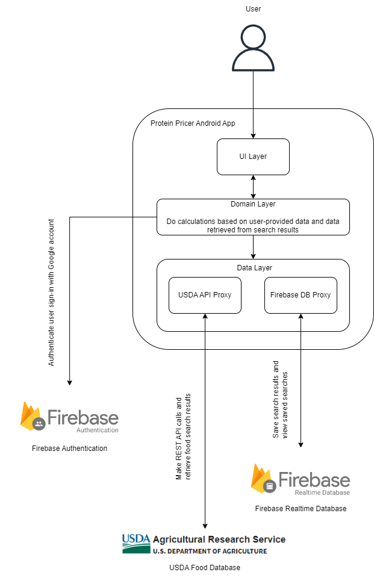
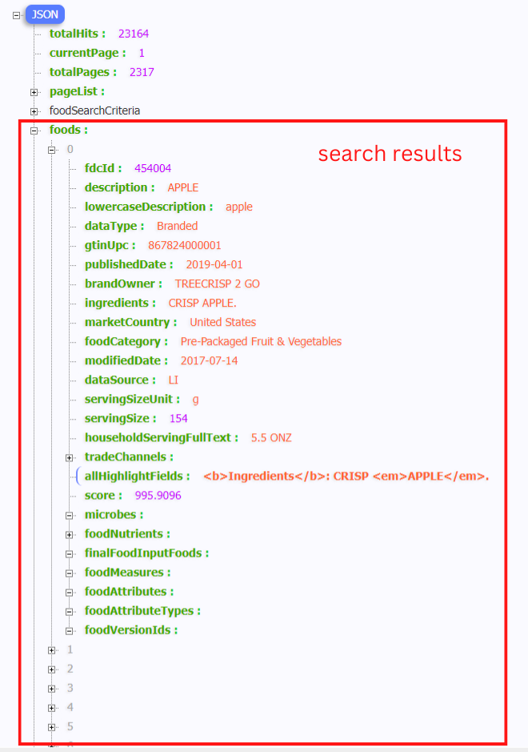
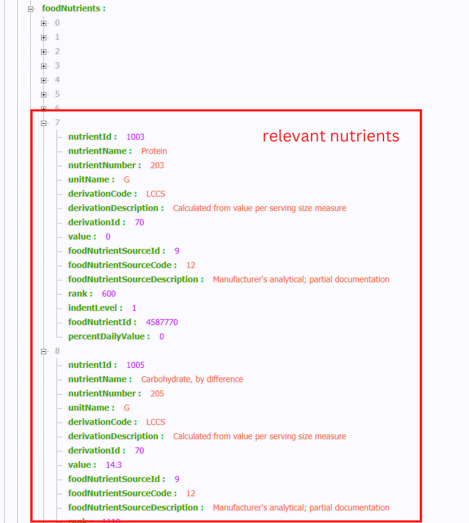

# Protein Pricer: CMPE272 Fall 2022 Team 1 Project
CMPE 272 Enterprise Software Platforms Instructor: Professor Rakesh Ranjan Computer Engineering Department
San José State University https://github.com/rayraysheng/cmpe272-team1-project

Ray Sheng
Software Engineering, San José State University 
yumeng.sheng@sjsu.edu

Kai-Wei Yang
Computer Engineering, San José State University
kai-wei.yang@sjsu.edu

Lalitha Ramya Vemuri
Software Engineering, San José State University 
lalitharamya.vemuri@sjsu.edu

Zeel Vasant Satasiya
Software Engineering, San José State University
zeelvasant.satasiya@sjsu.edu

## Abstract
The number one macronutrient desired by dieters, athletes, and bodybuilders alike is protein, which is also the most expensive macronutrient[1]. In this report, we present a consumer-friendly solution for calculating and comparing food prices based on the amount of protein they provide per dollar spent. We plan on developing an Android application that enables the user to search for specific food items from the United States Department of Agriculture FoodData Central database to calculate their protein-per-dollar value, with the option of saving their search results to their account (stored in Firebase Realtime Database) for quick reference in the future.

Keywords—Dieting and fitness; food price comparison; meal planning; Android application; Firebase Realtime Database.

## INTRODUCTION
With time growing, people tend to live healthier lives and acquire enough nutrition to sustain muscle growing and energy supplement. The food in the market varies from different places. The customers would have a lot of choice to get the food they want. However, the food with similar nutrition would be priced differently. For example, the price of the chicken breast and the chicken tender with the same amount of protein may have over 5 bucks more price difference. People nowadays tend to get the nutrition with a cheaper price to save some money. Dieters, athletes, and bodybuilders would need to consume an amount of protein to meet their daily intake to build muscle. To consume the huge amount of protein, people would compare the food price in the market and get the protein with the best cost-performance ratio. Therefore, a tool to calculate the protein per gram would be necessary for users to record and save their budget. In our project, we would design an android application for users to input the food they want to get in the market. After the app users input the food name, the android application would calculate the protein per gram for the users and store the search history data in the local storage. With the search history and the protein calculation result. Users could compare the results and choose the food with the best cost-price ratio in the market. We would elaborate more on our application structure and function in the following section.  

There are many mobile applications on the market that help people keep track of what they eat and make dietary decisions based on energy intake. The functions of these applications vary in scope: some may offer advice and encouragement for weight loss, while others might simply serve as a calorie tracking tool without any bells and whistles. One niche area that seems to not have been covered yet is to take into consideration the economic factor - helping dieters get the most bang for their buck when they plan their meals. 

The Protein Pricer app is not meant to be a replacement for the meal-tracking apps that are currently available on the market, it is instead meant to be a specialized companion app that helps the user choose sources of protein based on price when they shop for groceries. Nor does our app attempt to coach users on how to plan their diet, i.e. tell them what to eat. That is an area that requires the users themselves to take personal responsibility to do their own research. 

## PERSONA
Dieters, Athletes, Bodybuilders
People that have a need for high protein intake who are either unable or unwilling to allocate large budgets for their food can use our app to compare different sources of protein based on price.

## SYSTEM ARCHITECTURE

Our Android app consists of an UI layer that takes user input and displays search/calculation results, a Domain layer that handles the calculations, and a data layer that processes the data used in the calculations and display.
The Domain layer uses the users’ Google accounts to handle user sign-in via Firebase Authentication services. The Data layer makes HTTP API calls to retrieve food item data from the USDA FoodData Central database. The Data layer also connects to Firebase Realtime Database services to save and retrieve user’s saved searches.

Figure 1: Architecture

### User Interface
The users could sign in their google account in the user sign in page to authenticate their identity. After the user verification, users would route to our home page(search page). If users do not have an account, they can just click on the skip sign in button to move to the home page. On the home page, people can enter the food name or the key word of the food in the search bar. After the application gets the name of the food, the app would return a food list with the same name of the food with different brands for users to choose. Users would choose the brand of the food which the user gets. With all the information, the application would take the users to the calculation page. On the calculation page, there are two input boxes for users to enter. One is the total gram of the food. The other is the price of the food. After users input the total gram of the food and the price of it. The calculation page would return how many proteins per dollar and display on the calculation page. For every users’ search, the search history page would list all the searches for the users to acquire the information faster if they want to re-search the item. Moreover, there is a home button on each page for users to redirect to the home page.

### Back-End Database
For storing the data we have used Firebase Real-time Database. It allows you to directly communicate with the database from the front-end and store data in real time. Firebase is a cloud-hosted NoSQL database that allows storing data in the form of JSON. This makes it easier for us to extract relevant data from the database by applying filters and displaying it to the users. 

When a user adds the food item to the saved list, we use the food item ID as the unique identifier to save it in the database. This ensures that the item is not being duplicated in the database and the user’s saved list is maintained without any conflicts. The data of each user is stored separately and can be extracted using the unique userID that is maintained during the session.

Firebase also provides an authentication feature using password, phone numbers and also using identity providers like Google, Facebook. Firebase has an Authentication SDK, which provides methods to manage users and create their profiles by signing up using email IDs and passwords. We have integrated the login page with federated identity providers which will allow users to directly sign in with a google account.

### Data Source
Commercial meal-tracking apps on the market usually create and maintain their own database for nutrition information on food items. For this project, this approach would not be feasible for us, as we do not have the resources to do so. Instead, we used the FoodData Central API to access FoodData Central, maintained by the United States Department of Agriculture.

When a search term is entered by the user through the UI layer of the app, an URL is constructed by the app to make an API call to the FoodData Central database, which returns the response in JSON format. The API response contains the metadata of the search, as well as a list of JSON objects that represent the specific food items that are returned (figure 2). 

Figure 2: API Response

The Data layer of the app parses the response and isolates the food item objects. From these food item objects, the Data layer then parses each food item and extracts the relevant nutrient information that is used in calculations in the Domain layer and displayed in the UI layer (figure 3).

Figure 3: Relevant Nutrients

## FUTURE IMPROVEMENTS
Currently, our application is using the USDA dataset and their APIs to access various food items. But in order to maintain consistency and faster access, we can create a database with the most frequently searched items. The application design currently accepts keywords to retrieve data. But we can expand this design and integrate search suggestions based on previous searches, saved items, location which will help users with exploring options. Users can further search for outlets and stores that have an ongoing sale and discounts to assist users in making more economic choices. 

To expand the saved list, we will also add features to manage and predict daily, monthly and weekly costs depending on the protein intake and average amount spent on a daily basis. Based on the data the users want to display, the options can be customized.

Another improvement that can be made is to include allergies and other dietary restrictions so that the app can make an informed decision on what options and choices should be displayed, thus improving the display with more personalized results.

## CONCLUSION
The Protein Pricer app enables the user to search and compare the amount of protein different food items provide vis-a-vis their dollar cost. It taps into a central database maintained by the United States Department of Agriculture for macronutrient values to ensure accuracy and convenience. It also allows the user to save their search results to their user account in a Firebase Realtime Database, so they can be retrieved later for quick reference and comparison. Armed with this tool, any user that prioritizes protein intake can have a convenient way to get the most bang for their buck when it comes to protein sources.

## Project Repository
Github Repository: https://github.com/rayraysheng/cmpe272-team1-project 
APK Download Link:
https://github.com/rayraysheng/cmpe272-team1-project/blob/main/protein_pricer.apk 

## References
Drewnowski A. (2010). The cost of US foods as related to their nutritive value. The American journal of clinical nutrition, 92(5), 1181–1188. https://doi.org/10.3945/ajcn.2010.29300 